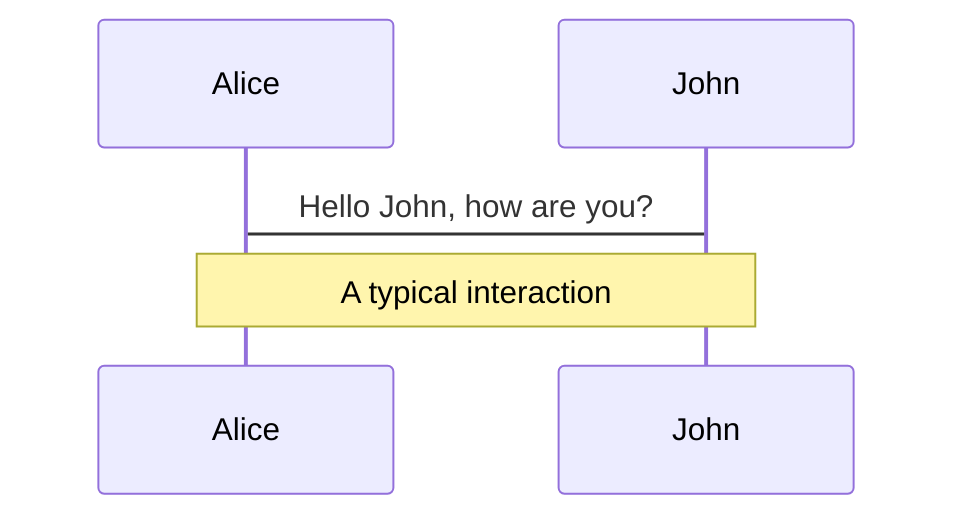
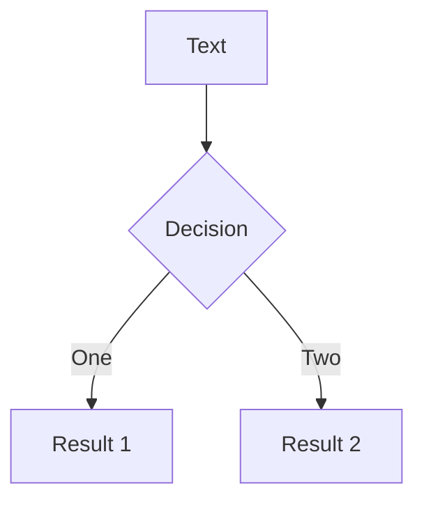
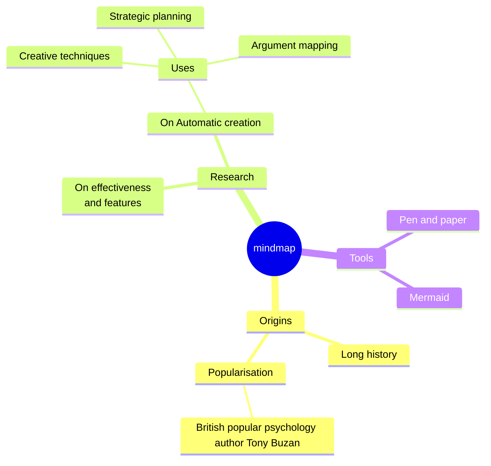
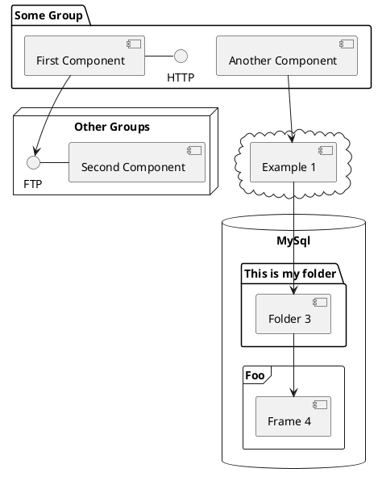

---
# You can also start simply with 'default'
theme: hep
preTitle: "Nuclear Reaction Studies Using Weakly Bound Projectiles: Structure and Dynamics"
authors:  # First author should be the presenter
  - Jin Lei: ["School of Physics Science and Engineering, Tongji University, Shanghai 200092, China."] 
meeting: "xXX"


---


<!--  </img> -->

<style scoped>
#ATLAS {
  width: 180px;
  position: absolute;
  right: 3%;
  bottom: 4%;
  /* background-color: #2B90B6;
  background-image: linear-gradient(45deg, #4EC5D4 15%,rgb(72, 97, 107) 50%); */
}
</style>

---
layout: pageBar
level: 
---

# Nuclear Reactions: use light weakly bound projectiles

<div class="grid grid-cols-2 gap-6 h-96">
  <!-- Left half: Large Chart of Nuclides -->
  <div class="text-center">
    
  </div>
  
  <!-- Right half: Other images stacked -->
  <div class="grid grid-rows-2 gap-4">
    <div v-click>
      <div class="text-center">
        
        <p class="text-sm">Incomplete fusion of weakly bound projectiles</p>
      </div>
    </div>
    <div v-click>
      <div class="text-center">
        
        <p class="text-sm">Properties of halo nuclei</p>
      </div>
    </div>
  </div>
</div>

---
layout: pageBar
---

# What are Nuclear Reactions?

<div class="grid grid-cols-2 gap-6 h-96">
  <div class="text-center">
    
  </div>
  <div class="grid grid-rows-4 gap-4">
    <div v-click>
      <div class="text-left space-y-1">
        <p class="text-xl" style="color: #EA33F0;">Extract optical potential, rms radius, density distributions</p>
      </div>
    </div>
        <div v-click>
      <div class="text-left space-y-1">
        <p class="text-xl" style="color: #EA33F0;">Extract spin, parity, spectroscopic factors example: <sup>132</sup>Sn(d,p)<sup>133</sup>Sn</p>
      </div>
    </div>
    <div v-click>
      <div class="text-left space-y-1">
        <p class="text-xl" style="color: #EA33F0;">Study nuclear dynamics properties of halo nuclei</p>
      </div>
    </div>
    <div v-click>
      <div class="text-left space-y-1">
        <p class="text-xl" style="color: #4A9CF7;">Provide energy for star burning synthesis of elements</p>
      </div>
    </div>
  </div>
</div>

---
layout: pageBar
---

# Outline

<div class="h-full flex flex-col justify-center">
  <ul class="text-3xl space-y-4">
    <li style="color: grey;">Introduction</li>
    <li>Modeling the Nuclear Reactions in Few-body Models</li>
    <li>Computing the Breakup Cross Sections</li>
    <li>Conclusions</li>
  </ul>
</div>

---
layout: pageBar
---

# Modeling the Elastic Scattering in two-body model 
Take the use of effective interactions

<v-clicks>

- **Elastic scattering** occurs when two particles interact and separate without any change in their internal energy states or particle identities

- The elastic scattering can be described by a **two-body model** with an effective interaction

- We developed a new computer code, **COLOSS**, using the complex scaling method to compute elastic scattering cross sections
  
  *J. Liu, **JL**, Z. Ren, Computer Physics Communications* **311** (2025) 109568

- **Schrödinger equation:**
  $$\left[-\frac{\hbar^2}{2 \mu} \frac{\mathrm{d}^2}{\mathrm{d} r^2}+\frac{\hbar^2}{2 \mu} \frac{\ell(\ell+1)}{r^2}+U_N(r)\right] \psi_{\ell}(r)=E \psi_{\ell}(r)$$

- **Wave function separation:**
  $$\psi_{\ell}(r)=e^{i \sigma_{\ell}} F_{\ell}(\eta, k r)+\psi_{\ell}^{\mathrm{sc}}(r)$$

- **Complex scaling transformation:**
$$\left[E-H^\theta(r)\right] \psi_{\ell}^{\mathrm{sc}, \theta}(r)=e^{i \theta / 2} e^{i \sigma_{\ell}} \tilde{U}_N\left(r e^{i \theta}\right) F_{\ell}\left(\eta, k r e^{i \theta}\right)$$

</v-clicks>

---
layout: pageBar
---

# Modeling the Elastic Scattering in two-body model 
Take the use of effective interactions
- **Wave function expansion:**
  $$\psi_{\ell}^{\mathrm{sc}, \theta}(r)=\sum_{j=1}^{N_r} c_j g_j(r)$$

- **Linear equation system:**
  $$\sum_{j=1}^{N_r}\left[E \mathbf{N}_{ij}-\mathbf{H}_{ij}^\theta\right] c_j= b_i^\theta$$

- **Results:**
<div class="flex justify-center gap-6 mt-8">
  <v-click>
    
  </v-click>
  
  <v-click>
    
  </v-click>
  
  <v-click>
    
  </v-click>
</div>

---
layout: pageBar
---

# Navigation

Hover on the bottom-left corner to see the navigation's controls panel

## Keyboard Shortcuts

|     |     |
| --- | --- |
| <kbd>space</kbd> / <kbd>tab</kbd> / <kbd>right</kbd> | next animation or slide |
| <kbd>left</kbd>  / <kbd>shift</kbd><kbd>space</kbd> | previous animation or slide |
| <kbd>up</kbd> | previous slide |
| <kbd>down</kbd> | next slide |

---
layout: pageBar
---

# The Lagrangian

The mathematical formulation of the Standard Model of particle physics


The Standard Model of particle physics is a **quantum field theory**. 
Therefore, its <span style="color:#ac1944;">fundamental elements are quantum fields</span> and the excitations of these fields are *identified* as **particles**.
All information is encoded in a compact description—the so-called ‘Lagrangian’ ( $\mathcal{L}$ ), which is an extremely compact notation.

In the physics classroom, however, it is very difficult to achieve a deep-level understanding because the required mathematics skills go far beyond high-school level. Hence, we will only treat the ultra-short Lagrangian as below:
$$
\mathcal{L} = \color{#9d6fa5}{ -\frac{1}{4} F_{\mu\nu} F^{\mu\nu} } 
              + \color{#c90024}{ i\bar{\psi} {\mathcal{D}}\!\!\!\!/ \psi }
              + \mathrm{h.c.} 
              + \color{#296b4c}{ \psi_i y_{ij} \psi_j \phi }
              + \mathrm{h.c.} 
              + \color{#4d45cc}{ |\mathcal{D}_{\mu} \phi |{ }^2 }
              - \color{#fe7b26}{ V(\phi) }
$$

<div class="grid grid-cols-3 gap-5 items-center justify-center">

<div class="col-span-2">

> - <span style="color: #9d6fa5"> $F_{\mu\nu} F^{\mu\nu}$: This term is the scalar product of the field strength tensor $F_{\mu\nu}$ containing the mathematical encoding of all interaction particles except the Higgs boson. It contains the necessary formulation for these particles to even exist, and describes how they interact with each other. </span>
> - <span style="color: #c90024"> $i\bar{\psi} {\mathcal{D}}\!\!\!\!/ \psi$: This term describes how interaction particles interact with matter particles. The fields $\psi$ and $\bar{\psi}$ describe (anti)quarks and (anti)leptons. </span>
> - <span style="color: #296b4c"> $\psi_i y_{ij} \psi_j \phi$: This term describes how matter particles couple to the Brout–Englert–Higgs field $\psi$ and thereby obtain mass. </span>
> - <span style="color: #4d45cc"> $|\mathcal{D}_{\mu} \phi |{ }^2$: This term describes how the interaction particles couple to the BEH field. This applies only to the interaction particles of the weak interaction ($W^{\pm}, Z$), which thereby obtain their mass. </span>
> - <span style="color: #fe7b26"> $V(\phi)$: This term describes the potential of the BEH field.  </span>

</div>
<div class="col-span-1">

<Transform :scale="1.0">

</Transform>

</div>

</div>

<style scoped>
.slidev-layout blockquote {
  font-size: 1rem;
}

li {
  margin-top: 0.25rem;
  margin-bottom: 0.25rem;
}

</style>

---
layout: pageBar
---

# 2-D Plotly Examples

Two 2D plots for display

Try to interact with the graphs 🥰

<div grid="~ cols-2 gap-20">

<Transform :scale="0.75">
<PlotlyGraph filePath="Graph/plotly1.json" tickFontSize="18" graphWidth="800"/>
</Transform>

<Transform :scale="0.75">
<PlotlyGraph filePath="Graph/plotly1.json" tickFontSize="18" graphWidth="800"/>
</Transform>

</div>


---
layout: pageBar
---

# 3-D Plotly Examples

Two 3D plots for display

Try to interact with the graphs 🥰

<div grid="~ cols-2 gap-20">

<Transform :scale="0.65">
<PlotlyGraph filePath="Graph/plotly2.json" graphWidth="900"/>
</Transform>

<Transform :scale="0.65">
<PlotlyGraph filePath="Graph/plotly3.json" graphWidth="900"/>
</Transform>

</div>


---
layout: center
class: "text-center"
---

# Learn More

[Documentations](https://sli.dev) / [GitHub Repo](https://github.com/slidevjs/slidev)


---
layout: pageBar
---

# What is Slidev?

Slidev is a slides maker and presenter designed for developers, consist of the following features

- 📝 **Text-based** - focus on the content with Markdown, and then style them later
- 🎨 **Themable** - themes can be shared and re-used as npm packages
- 🧑‍💻 **Developer Friendly** - code highlighting, live coding with autocompletion
- 🤹 **Interactive** - embed Vue components to enhance your expressions
- 🎥 **Recording** - built-in recording and camera view
- 📤 **Portable** - export to PDF, PPTX, PNGs, or even a hostable SPA
- 🛠 **Hackable** - virtually anything that's possible on a webpage is possible in Slidev
<br>
<br>

Read more about [Why Slidev?](https://sli.dev/guide/why)

<!--
You can have `style` tag in markdown to override the style for the current page.
Learn more: https://sli.dev/features/slide-scope-style
-->

<style>
h1 {
  background-color: #2B90B6;
  background-image: linear-gradient(45deg, #4EC5D4 10%, #146b8c 20%);
  background-size: 100%;
  -webkit-background-clip: text;
  -moz-background-clip: text;
  -webkit-text-fill-color: transparent;
  -moz-text-fill-color: transparent;
}
</style>

<!--
Here is another comment.
-->

---
layout: pageBar
---

# Navigation

Hover on the bottom-left corner to see the navigation's controls panel, [learn more](https://sli.dev/guide/ui#navigation-bar)

## Keyboard Shortcuts

|                                                     |                             |
| --------------------------------------------------- | --------------------------- |
| <kbd>right</kbd> / <kbd>space</kbd>                 | next animation or slide     |
| <kbd>left</kbd>  / <kbd>shift</kbd><kbd>space</kbd> | previous animation or slide |
| <kbd>up</kbd>                                       | previous slide              |
| <kbd>down</kbd>                                     | next slide                  |

<!-- https://sli.dev/guide/animations.html#click-animation -->

<p v-after class="absolute bottom-23 left-45 opacity-30 transform -rotate-10">Here!</p>

---
layout: two-cols
layoutClass: gap-16
---

# Code

Use code snippets and get the highlighting directly, and even types hover!

```ts [filename-example.ts] {all|4|6|6-7|9|all} twoslash
// TwoSlash enables TypeScript hover information
// and errors in markdown code blocks
// More at https://shiki.style/packages/twoslash
import { computed, ref } from 'vue'

const count = ref(0)
const doubled = computed(() => count.value * 2)

doubled.value = 2
```

<arrow v-click="[4, 5]" x1="350" y1="310" x2="195" y2="342" color="#953" width="2" arrowSize="1" />

<!-- This allow you to embed external code blocks -->
<<< @/snippets/external.ts#snippet

<!-- Footer -->

[Learn more](https://sli.dev/features/line-highlighting)

<!-- Inline style -->
<style>
.footnotes-sep {
  @apply mt-5 opacity-10;
}
.footnotes {
  @apply text-sm opacity-75;
}
.footnote-backref {
  display: none;
}
</style>

<!--
Notes can also sync with clicks

[click] This will be highlighted after the first click

[click] Highlighted with `count = ref(0)`

[click:3] Last click (skip two clicks)
-->

---
level: 2
---

# Shiki Magic Move

Powered by [shiki-magic-move](https://shiki-magic-move.netlify.app/), Slidev supports animations across multiple code snippets.

Add multiple code blocks and wrap them with <code>````md magic-move</code> (four backticks) to enable the magic move. For example:

````md magic-move {lines: true}
```ts {*|2|*}
// step 1
const author = reactive({
  name: 'John Doe',
  books: [
    'Vue 2 - Advanced Guide',
    'Vue 3 - Basic Guide',
    'Vue 4 - The Mystery'
  ]
})
```

```ts {*|1-2|3-4|3-4,8}
// step 2
export default {
  data() {
    return {
      author: {
        name: 'John Doe',
        books: [
          'Vue 2 - Advanced Guide',
          'Vue 3 - Basic Guide',
          'Vue 4 - The Mystery'
        ]
      }
    }
  }
}
```

```ts
// step 3
export default {
  data: () => ({
    author: {
      name: 'John Doe',
      books: [
        'Vue 2 - Advanced Guide',
        'Vue 3 - Basic Guide',
        'Vue 4 - The Mystery'
      ]
    }
  })
}
```

Non-code blocks are ignored.

```vue
<!-- step 4 -->
<script setup>
const author = {
  name: 'John Doe',
  books: [
    'Vue 2 - Advanced Guide',
    'Vue 3 - Basic Guide',
    'Vue 4 - The Mystery'
  ]
}
</script>
```
````

---

# Components

<div grid="~ cols-2 gap-4">
<div>

You can use Vue components directly inside your slides.

We have provided a few built-in components like `<Tweet/>` and `<Youtube/>` that you can use directly. And adding your custom components is also super easy.

```html
<Counter :count="10" />
```

<!-- ./components/Counter.vue -->
<Counter :count="10" m="t-4" />

Check out [the guides](https://sli.dev/builtin/components.html) for more.

</div>
<div>

```html
<Tweet id="1390115482657726468" />
```

<Tweet id="1390115482657726468" scale="0.65" />

</div>
</div>

<!--
Presenter note with **bold**, *italic*, and ~~striked~~ text.

Also, HTML elements are valid:
<div class="flex w-full">
  <span style="flex-grow: 1;">Left content</span>
  <span>Right content</span>
</div>
-->

---
class: px-20
---

# Themes

Slidev comes with powerful theming support. Themes can provide styles, layouts, components, or even configurations for tools. Switching between themes by just **one edit** in your frontmatter:

<div grid="~ cols-2 gap-2" m="t-2">

```yaml
---
theme: default
---
```

```yaml
---
theme: seriph
---
```


</div>

Read more about [How to use a theme](https://sli.dev/guide/theme-addon#use-theme) and
check out the [Awesome Themes Gallery](https://sli.dev/resources/theme-gallery).

---

# Clicks Animations

You can add `v-click` to elements to add a click animation.

<div v-click>

This shows up when you click the slide:

```html
<div v-click>This shows up when you click the slide.</div>
```

</div>

<br>

<v-click>

The <span v-mark.red="3"><code>v-mark</code> directive</span>
also allows you to add
<span v-mark.circle.orange="4">inline marks</span>
, powered by [Rough Notation](https://roughnotation.com/):

```html
<span v-mark.underline.orange>inline markers</span>
```

</v-click>

<div mt-20 v-click>

[Learn more](https://sli.dev/guide/animations#click-animation)

</div>

---

# Motions

Motion animations are powered by [@vueuse/motion](https://motion.vueuse.org/), triggered by `v-motion` directive.

```html
<div
  v-motion
  :initial="{ x: -80 }"
  :enter="{ x: 0 }"
  :click-3="{ x: 80 }"
  :leave="{ x: 1000 }"
>
  Slidev
</div>
```

<div class="w-60 relative">
  <div class="relative w-40 h-40">
    
    
    
  </div>

  <div
    class="text-5xl absolute top-14 left-40 text-[#2B90B6] -z-1"
    v-motion
    :initial="{ x: -80, opacity: 0}"
    :enter="{ x: 0, opacity: 1, transition: { delay: 2000, duration: 1000 } }">
    Slidev
  </div>
</div>

<!-- vue script setup scripts can be directly used in markdown, and will only affects current page -->
<script setup lang="ts">
const final = {
  x: 0,
  y: 0,
  rotate: 0,
  scale: 1,
  transition: {
    type: 'spring',
    damping: 10,
    stiffness: 20,
    mass: 2
  }
}
</script>

<div
  v-motion
  :initial="{ x:35, y: 30, opacity: 0}"
  :enter="{ y: 0, opacity: 1, transition: { delay: 3500 } }">

[Learn more](https://sli.dev/guide/animations.html#motion)

</div>

---

# LaTeX

LaTeX is supported out-of-box. Powered by [KaTeX](https://katex.org/).

<div h-3 />

Inline $\sqrt{3x-1}+(1+x)^2$

Block
$$ {1|3|all}
\begin{aligned}
\nabla \cdot \vec{E} &= \frac{\rho}{\varepsilon_0} \\
\nabla \cdot \vec{B} &= 0 \\
\nabla \times \vec{E} &= -\frac{\partial\vec{B}}{\partial t} \\
\nabla \times \vec{B} &= \mu_0\vec{J} + \mu_0\varepsilon_0\frac{\partial\vec{E}}{\partial t}
\end{aligned}
$$

[Learn more](https://sli.dev/features/latex)

---

# Diagrams

You can create diagrams / graphs from textual descriptions, directly in your Markdown.

<div class="grid grid-cols-4 gap-5 pt-4 -mb-6">









</div>

Learn more: [Mermaid Diagrams](https://sli.dev/features/mermaid) and [PlantUML Diagrams](https://sli.dev/features/plantuml)

---
foo: bar
dragPos:
  square: 691,32,167,_,-16
---

# Draggable Elements

Double-click on the draggable elements to edit their positions.

<br>

###### Directive Usage

```md

```

<br>

###### Component Usage

```md
<v-drag text-3xl>
  <div class="i-carbon:arrow-up" />
  Use the `v-drag` component to have a draggable container!
</v-drag>
```

<v-drag pos="663,206,261,_,-15">
  <div text-center text-3xl border border-main rounded>
    Double-click me!
  </div>
</v-drag>


###### Draggable Arrow

```md
<v-drag-arrow two-way />
```

<v-drag-arrow pos="67,452,253,46" two-way op70 />

---
src: ./pages/imported-slides.md
hide: false
---

---

# Monaco Editor

Slidev provides built-in Monaco Editor support.

Add `{monaco}` to the code block to turn it into an editor:

```ts {monaco}
import { ref } from 'vue'
import { emptyArray } from './external'

const arr = ref(emptyArray(10))
```

Use `{monaco-run}` to create an editor that can execute the code directly in the slide:

```ts {monaco-run}
import { version } from 'vue'
import { emptyArray, sayHello } from './external'

sayHello()
console.log(`vue ${version}`)
console.log(emptyArray<number>(10).reduce(fib => [...fib, fib.at(-1)! + fib.at(-2)!], [1, 1]))
```

---
layout: center
class: text-center
---

# Learn More

[Documentation](https://sli.dev) · [GitHub](https://github.com/slidevjs/slidev) · [Showcases](https://sli.dev/resources/showcases)

<PoweredBySlidev mt-10 />
